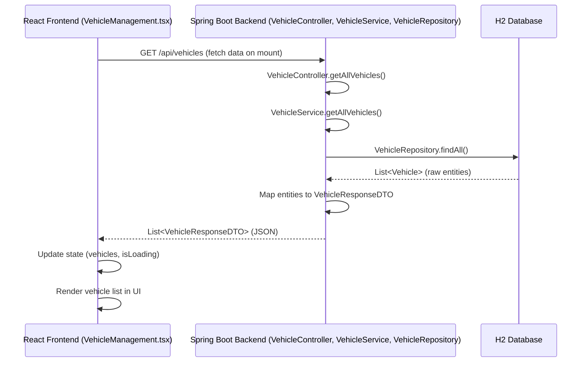
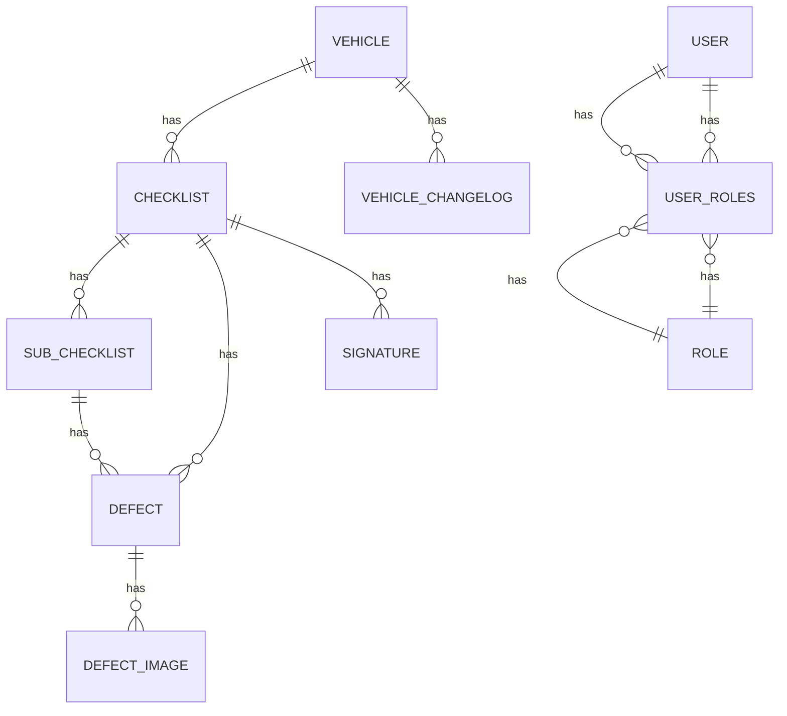

# Frontend-Backend Integration Summary

This document summarizes the integration process between the React frontend and the Spring Boot backend, along with a technical reference for developers.

## 1. Integration Steps

The integration involved the following key steps:

### 1.1. CORS Configuration (Backend)

To allow the frontend (running on `http://localhost:3000`) to make requests to the backend (running on `http://localhost:8080`), Cross-Origin Resource Sharing (CORS) was enabled on the Spring Boot backend.

*   A `WebConfig.java` class was created in `src/main/java/com/muvs/inspection_system/config/` to configure CORS.
*   The `addCorsMappings` method was overridden to allow `GET`, `POST`, `PUT`, `DELETE`, `OPTIONS` methods from `http://localhost:3000` to all `/api/**` endpoints.

### 1.2. Frontend API Calls

The `frontend/components/VehicleManagement.tsx` component was modified to fetch vehicle data from the backend.

*   **Mock data replacement:** The `MOCK_VEHICLES` array was replaced with an asynchronous `fetch` call to the backend's `/api/vehicles` endpoint.
*   **Loading and Error States:** `isLoading` and `error` states were introduced to provide user feedback during data fetching.
*   **Data rendering:** The fetched data is now used to populate the vehicle table and update the statistics strip dynamically.

### 1.3. Running the Integrated Application

To run the full integrated application:

#### Prerequisites

*   Java Development Kit (JDK) 17 or higher
*   Maven (usually comes with your IDE, or can be installed separately)
*   Node.js and npm (or Yarn)
*   A text editor or IDE (e.g., IntelliJ IDEA, VS Code)

#### Steps to Run Backend

1.  Open a terminal in the project's root directory (`muvs-inspection-system`).
2.  Run the backend application:
    ```bash
    mvn spring-boot:run
    ```
    The backend will start on `http://localhost:8080`.

#### Steps to Run Frontend

1.  Open a **new terminal** and navigate to the `frontend` directory:
    ```bash
    cd frontend
    ```
2.  Install frontend dependencies (if you haven't already):
    ```bash
    npm install
    ```
3.  Start the frontend development server:
    ```bash
    npm run dev
    ```
    The frontend application will typically open in your browser at `http://localhost:3000`.

## 2. Technical Reference Document (Developer's Guide)

### 2.1. System Architecture

The MUVS Inspection System follows a layered architectural pattern, commonly seen in enterprise applications, primarily implemented using Java Spring Boot for the backend and React for the frontend.

**Diagram: High-Level System Architecture**

```mermaid
graph TD
    UserInterface[Web Browser (React Frontend)] -- HTTP/REST --> Backend[Spring Boot Backend]
    Backend -- JPA/Hibernate --> Database[H2 Database (in-memory)]
    Backend -- AWS SDK --> S3[AWS S3 (Image Storage)]
```

#### 2.1.1. Backend (Spring Boot)

*   **Core Framework:** Spring Boot (simplifies Spring application development).
*   **Web Layer:** RESTful API endpoints defined using Spring MVC (`@RestController`, `@RequestMapping`). Controllers (`ChecklistController`, `DefectController`, `VehicleController`, `SubChecklistController`) handle HTTP requests, input validation (`@Valid`), and return JSON responses.
*   **Service Layer:** Contains the core business logic. Services (`ChecklistService`, `DefectService`, `VehicleService`, `SubChecklistService`) implement interfaces and are annotated with `@Service` and `@Transactional` for transaction management. They orchestrate data access and apply business rules.
*   **Data Access Layer (Repository):** Utilizes Spring Data JPA for abstracting database interactions. Repositories extend `JpaRepository` providing CRUD operations and query derivation (`findBy...`).
    *   **Entities:** JPA entities (`Vehicle`, `Checklist`, `SubChecklist`, `Defect`, `DefectImage`, `Signature`, `VehicleChangeLog`, `User`, `Role`) mapped to database tables using annotations (`@Entity`, `@Table`, `@Id`, `@Column`, `@OneToMany`, `@ManyToOne`, `@JoinColumn`, etc.).
    *   **Database:** Configured for H2 in-memory database for development simplicity (`application.yml`). Persistence is `create-drop`, meaning schema is generated and data is re-initialized on each application start.
*   **Security:**
    *   Spring Security is integrated for authentication.
    *   `SecurityConfig.java`: Configures `SecurityFilterChain` for HTTP Basic authentication, securing `/api/**` endpoints and permitting all others.
    *   `PasswordEncoder`: Uses `BCryptPasswordEncoder` for secure password hashing.
    *   `User`, `Role` Entities: Define user and role structures.
    *   `UserRepository`, `RoleRepository`: Data access for users and roles.
    *   `UserDetailsServiceImpl`: Implements `UserDetailsService` to load user-specific data during authentication.
    *   `DataLoader`: A `CommandLineRunner` component that initializes default `admin` and `user` accounts with predefined roles and hashed passwords into the H2 database on application startup.
*   **Image Storage:** Integration with AWS S3 (`AwsS3Config.java`, `ImageStorageService.java`) for storing and retrieving images related to defects and checklists. (Note: AWS credentials are expected from environment variables).
*   **Cross-Origin Resource Sharing (CORS):** `WebConfig.java` explicitly allows requests from the frontend origin (`http://localhost:3000`) to backend API endpoints (`/api/**`).
*   **Error Handling:** Global exception handling (`GlobalExceptionHandler.java`) to provide consistent error responses (e.g., `ErrorResponse` DTO) for common exceptions like `ResourceNotFoundException`.
*   **Data Transfer Objects (DTOs):** Used for data transfer between layers and for defining API request/response structures (e.g., `VehicleRequestDTO`, `VehicleResponseDTO`).

#### 2.1.2. Frontend (React with Vite)

*   **Framework:** React (UI library).
*   **Build Tool:** Vite (fast development server and build tool).
*   **Language:** TypeScript.
*   **Styling:** Tailwind CSS (utility-first CSS framework for rapid UI development).
*   **Components:** Modular UI components (`components/Dashboard.tsx`, `components/VehicleManagement.tsx`, etc.) are responsible for rendering specific parts of the application and interacting with the backend API.
*   **State Management:** Local component state managed with `useState` and effects with `useEffect`. For more complex applications, a global state management library might be considered (e.g., Redux, Zustand, React Context).
*   **Routing:** The `App.tsx` handles conditional rendering based on a `currentView` state, effectively acting as a simple client-side router for different sections of the application.
*   **API Communication:** Uses the browser's native `fetch` API for making HTTP requests to the Spring Boot backend.

### 2.2. Data Flow (Example: Fetching Vehicles)

**Diagram: Vehicle Data Flow**



### 2.3. Key Backend Entities (Simplified Relationships)

**Diagram: Core Entity Relationship Diagram (ERD)**


*Note: This diagram is a simplified representation. Actual relationships might involve more attributes or specific join tables.*

### 2.4. Common Backend Development Practices

*   **Layered Architecture:** Clear separation of concerns between Controller, Service, and Repository layers.
*   **RESTful Principles:** APIs designed around resources with standard HTTP methods.
*   **Dependency Injection:** Spring's `@Autowired` (or constructor injection with `@RequiredArgsConstructor` from Lombok) is used extensively.
*   **Database Interactions:** Spring Data JPA simplifies repository implementations.
*   **Lombok:** Reduces boilerplate code (getters, setters, constructors, builders).
*   **Transactional Management:** `@Transactional` ensures data consistency.

### 2.5. Common Frontend Development Practices

*   **Component-Based UI:** Modular and reusable React components.
*   **Functional Components & Hooks:** Utilizes `useState`, `useEffect` for component logic and state.
*   **Declarative UI:** React's approach to building user interfaces.
*   **Type Safety:** TypeScript ensures type checking during development.
*   **Modern JavaScript:** ES6+ features used throughout.

## 3. Frontend Stack Suggestion

For this project, given the current technology choices and the nature of the application (data management, forms, tables), the current **React with Vite and Tailwind CSS** setup is an excellent choice.

### Why this stack suits the project:

*   **React:**
    *   **Component-Based:** Ideal for building complex UIs with reusable pieces, which fits the various management screens (Vehicles, Checklists, Users).
    *   **Large Ecosystem:** Abundance of libraries and tools for almost any UI need (e.g., date pickers, form validation, charting).
    *   **Strong Community:** Extensive support and resources.
*   **Vite:**
    *   **Fast Development:** Extremely quick cold start and hot module reloading significantly improve developer experience compared to Webpack-based setups. This is crucial for iterating quickly on UI.
    *   **Lightweight:** Less configuration overhead.
*   **Tailwind CSS:**
    *   **Utility-First:** Enables rapid UI development by composing classes directly in markup, leading to highly consistent designs. This is visible in the existing mockups.
    *   **Customizable:** Easy to extend and tailor to specific design systems.
    *   **Performance:** Generates minimal CSS for production, only including what's actually used.
*   **TypeScript:**
    *   **Type Safety:** Catches errors early in development, especially important when interacting with a strongly-typed Java backend API. Improves code maintainability and understanding.

### Potential Enhancements:

While the current setup is solid, for a growing application, consider these additions to the frontend stack:

*   **State Management Library:** For more complex global state or inter-component communication, a library like **Zustand** (lightweight and simple) or **React Query/SWR** (for data fetching and caching) could be beneficial.
*   **Dedicated Router:** For more complex navigation and URL management, **React Router** would be a natural fit.
*   **UI Component Library:** If custom styling becomes too time-consuming, a pre-built component library like **Material UI** or **Ant Design** could accelerate development, though it might diverge from the current Tailwind aesthetic.
*   **Form Management Library:** For complex forms, **React Hook Form** or **Formik** can simplify form state management and validation.

In summary, the existing frontend stack is well-suited, and enhancements can be introduced incrementally as the project evolves.
